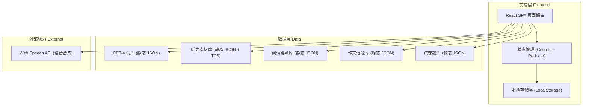
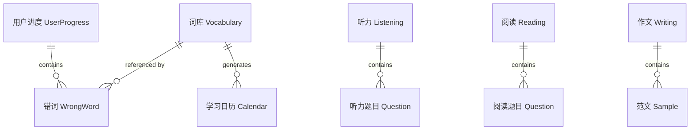

## 1. 架构设计



## 2. 技术说明
- **前端**：React@18 + React Router@6 + tailwindcss@3 + vite
- **初始化工具**：vite-init（`npm create vite@latest`）
- **后端**：无（纯前端应用，数据使用静态 JSON + LocalStorage 持久化）
- **数据库**：无服务端数据库；客户端使用 LocalStorage 存储学习进度、错题本、学习日历
- **外部能力**：Web Speech API（SpeechSynthesis）用于单词发音与听力播报的兜底语音
- **关键依赖**：
  - `react-router-dom@6` 路由
  - `framer-motion@11` 词卡翻转与页面过渡动画
  - `lucide-react` 细线图标
  - `clsx` 类名组合

## 3. 路由定义
| 路由 | 用途 |
|------|------|
| `/` | 首页（学习仪表盘） |
| `/vocabulary` | 单词背诵（每日词库列表） |
| `/vocabulary/study` | 单词词卡学习模式 |
| `/vocabulary/quiz` | 单词考察模式 |
| `/vocabulary/review` | 错词复习模式 |
| `/listening` | 听力播报（素材列表） |
| `/listening/:id` | 听力播放与作答 |
| `/reading` | 阅读理解（篇章列表） |
| `/reading/:id` | 阅读作答与解析 |
| `/writing` | 作文书写（话题列表） |
| `/writing/:id` | 写作编辑器与范文 |
| `/papers` | 试卷生成（组卷配置） |
| `/papers/exam/:id` | 试卷在线作答 |
| `/mistakes` | 错题本（错题汇总） |

## 4. API 定义
本项目为纯前端应用，无后端 API。所有数据通过本地 JSON 文件加载，学习状态通过 LocalStorage 持久化。

### 4.1 本地数据接口（静态 JSON）
- `/data/vocabulary.json`：CET-4 词库，结构 `{ id, word, phonetic, pos, meaning, example, exampleCn, difficulty }`
- `/data/listening.json`：听力素材，结构 `{ id, title, category, duration, audioText, audioTextCn, questions[] }`
- `/data/reading.json`：阅读篇章，结构 `{ id, title, passage, category, difficulty, questions[] }`
- `/data/writing.json`：作文话题，结构 `{ id, topic, type, requirement, sampleEssay, template }`
- `/data/papers.json`：试卷题库，按题型分组

### 4.2 LocalStorage 数据结构
```typescript
interface UserProgress {
  vocabulary: {
    currentDate: string;          // 当日词库日期 YYYY-MM-DD
    dayIndex: number;             // 第几天词库（用于定点更新）
    studied: string[];            // 已学单词 id
    mastered: string[];           // 已掌握单词 id
    wrong: WrongWord[];           // 错词本
  };
  calendar: Record<string, number>; // 日期 -> 学习单词数（热力图）
  stats: {
    totalDays: number;
    totalWords: number;
    accuracy: number;
  };
}

interface WrongWord {
  wordId: string;
  wrongCount: number;
  lastReview: string;       // 上次复习日期
  nextReview: string;       // 下次复习日期（间隔重复）
  mastery: 'new' | 'learning' | 'mastered';
}
```

## 5. 服务端架构图
不适用（纯前端应用，无服务端）。

## 6. 数据模型

### 6.1 数据模型定义


### 6.2 数据定义语言
本项目无服务端数据库，使用静态 JSON 作为"数据表"。以下为关键 JSON Schema 定义：

**CET-4 词库（vocabulary.json）**
```json
{
  "words": [
    {
      "id": "w_0001",
      "word": "abandon",
      "phonetic": "/əˈbændən/",
      "pos": "v.",
      "meaning": "放弃；遗弃",
      "example": "He abandoned his car in the snow.",
      "exampleCn": "他把车丢弃在雪地里。",
      "difficulty": 1
    }
  ]
}
```

**每日词库定点更新规则**：
- 词库按 `dayIndex` 分组，每组 50 词
- 当本地日期 ≥ 词库日期 + 1 时，自动切换到下一组（50 词）
- 已学/已掌握状态跨日保留；错词进入间隔重复队列
- 间隔重复算法（简化 SM-2）：错词在第 1、2、4、7 天重复出现，答对则晋级，答错重置

**学习日历（calendar）**
```json
{
  "calendar": {
    "2026-07-06": 50,
    "2026-07-05": 32
  }
}
```

**错题本（mistakes）**
```json
{
  "vocabulary": ["w_0003", "w_0017"],
  "reading": ["r_002", "r_005"],
  "listening": ["l_001"]
}
```
